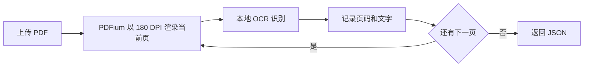
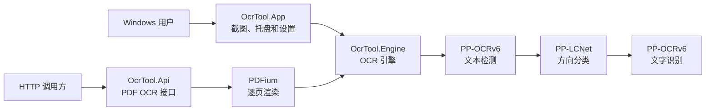
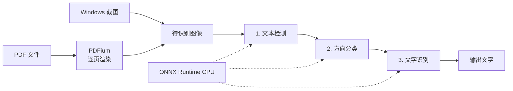

# OCR 工具

OCR 工具是一款运行在 Windows 10/11 x64 上的本地截图识别工具。按 F2 框选屏幕区域，识别结果会显示在窗口中，也可以自动复制到剪贴板。

截图和文字不会上传到云端。程序使用 CPU 运行 PP-OCRv6 small 模型，不需要独立显卡。

发布包还带有 PDF OCR API。API 默认不会启动，需要时手动运行即可；不用 API 时，不会占用端口或后台资源。

## 主要功能

- 按 F2 开始截图识别
- 支持多显示器
- 识别结果可以编辑和复制
- 可选择是否自动复制识别文字
- 可修改全局截图快捷键
- 可选择是否随 Windows 登录启动
- 提供 PDF OCR HTTP API
- 桌面端与 API 共用本地 OCR 模型

## 下载

从 [GitHub Releases](https://github.com/xytss/Ocr-tool/releases/latest) 下载最新版。

| 文件 | 适合的用途 |
| --- | --- |
| `OcrTool-x.y.z-win-x64-setup.msi` | Windows 安装版，安装后使用桌面或开始菜单快捷方式启动 |
| `OcrTool-x.y.z-win-x64-portable.zip` | Windows 绿色版，解压后直接运行，不写入 Program Files |
| `OcrTool-x.y.z-api-linux-x64.tar.gz` | Linux x64 PDF OCR API，不包含桌面截图程序 |

三个包都已包含 .NET 运行时、ONNX Runtime、OCR 模型和所需依赖，无需另外安装运行环境。

Windows 程序目前没有商业代码签名。安装或首次运行时，Windows 可能显示“未知发布者”或 SmartScreen 提示。

## Windows 安装

### MSI 安装版

1. 下载 `OcrTool-x.y.z-win-x64-setup.msi`。
2. 双击 MSI，按照 Windows Installer 提示完成安装。
3. 从桌面或开始菜单打开“OCR 工具”。

程序安装到 64 位 Program Files。卸载时，在 Windows 的“已安装的应用”中找到“OCR 工具”。

### 绿色版

1. 下载 `OcrTool-x.y.z-win-x64-portable.zip`。
2. 解压完整压缩包。
3. 运行解压目录中的 `OcrTool\OcrTool.App.exe`。

不要只复制 EXE。`models` 目录和其他 DLL 都是程序运行所需文件。绿色版不会自动创建快捷方式，也不需要管理员权限。

## 截图识别

1. 启动“OCR 工具”。
2. 按 F2。
3. 拖动鼠标框选需要识别的区域。
4. 松开鼠标，等待识别完成。
5. 在结果窗口中编辑或复制文字。

按 Esc 或鼠标右键可以取消框选。双击托盘图标也可以开始识别，右键托盘图标可以打开设置或退出程序。

如果 F2 已被其他程序占用，OCR 工具会打开设置窗口，请录入并保存新的快捷键。

## PDF OCR API

Windows 绿色版和 MSI 安装版都包含 API 程序。API 与桌面截图功能相互独立，不会随桌面程序自动启动。

当前 API 只接收 PDF 文件，不提供 PNG、JPG 等图片文件的上传接口。桌面端可以识别屏幕框选区域，但不能通过 HTTP 上传图片。PDF 接口返回每一页的纯文本，不包含文字坐标、置信度和版面结构。

### 在 Windows 上启动

绿色版：在解压后的 `OcrTool` 目录打开 PowerShell，运行：

~~~powershell
& '.\api\OcrTool.Api.exe' --urls 'http://127.0.0.1:5080'
~~~

MSI 安装版：

~~~powershell
& 'C:\Program Files\OCR Tool\api\OcrTool.Api.exe' --urls 'http://127.0.0.1:5080'
~~~

命令运行期间 API 保持启动。按 Ctrl+C 可以停止服务。

### 接口

| 方法和路径 | 作用 |
| --- | --- |
| `GET /health` | 检查服务是否正常 |
| `POST /api/ocr/pdf` | 上传 PDF 并按页返回识别文字 |

PDF 请求必须使用 `multipart/form-data`，文件字段名为 `file`。

PowerShell 调用示例：

~~~powershell
curl.exe --request 'POST' `
    --form 'file=@C:\Docs\sample.pdf;type=application/pdf' `
    'http://127.0.0.1:5080/api/ocr/pdf'
~~~

返回示例：

~~~json
{
  "pageCount": 2,
  "pages": [
    {
      "pageNumber": 1,
      "text": "第一页文字"
    },
    {
      "pageNumber": 2,
      "text": "第二页文字"
    }
  ]
}
~~~

PDF 会以 180 DPI 逐页渲染和识别，返回结果保持原页顺序。当前页处理完成后才会读取下一页，不会先把整份 PDF 的所有页面同时放入内存。

### 在 Linux x64 上启动

下载 `OcrTool-x.y.z-api-linux-x64.tar.gz`，然后运行：

~~~bash
mkdir -p 'ocr-tool'
tar -xzf OcrTool-*-api-linux-x64.tar.gz -C 'ocr-tool'
cd 'ocr-tool'
ASPNETCORE_URLS='http://127.0.0.1:5080' ./OcrTool.Api
~~~

如果需要让其他设备访问，可以把监听地址改为 `http://0.0.0.0:5080`。

API 本身没有身份认证。不要把端口直接暴露到公网；对外提供服务时，请通过反向代理或网关配置 HTTPS、访问控制和上传大小限制。

发布包中附有 `API使用说明.txt`，包含相同的启动方式和调用示例。

## 设置和数据位置

| 项目 | 绿色版 | MSI 安装版 |
| --- | --- | --- |
| 设置文件 | 程序目录中的 `settings.json` | `%LOCALAPPDATA%\OcrTool\settings.json` |
| 快捷方式 | 不自动创建 | 桌面和开始菜单 |
| 管理员权限 | 不需要 | 安装时需要 |
| 卸载方式 | 关闭程序后移走解压目录 | Windows“已安装的应用” |

开机启动设置保存在当前用户账户中，可以随时在程序设置里关闭。

## 工作流程

### 截图识别

程序启动后会在后台初始化 OCR 模型。用户完成框选后，程序只保留选中的图像区域并交给 OCR 引擎。一次识别尚未结束时，不会再次进入截图流程。

### PDF 识别

API 使用 PDFium 按页渲染 PDF。每一页转换为图片后立即识别，保存页码和文字，然后释放该页图像。所有页面处理完成后，接口返回按原页序排列的结果。

## 技术架构

桌面端和 API 共用 `OcrTool.Engine`，模型加载和识别逻辑只维护一份。Windows 桌面端负责截图和结果展示，API 负责把 PDF 页面转换为 OCR 可以处理的图片。

### OCR 处理步骤

无论图像来自屏幕截图还是 PDF 页面，进入 OCR 引擎后都会依次经过三个步骤：

| 顺序 | 步骤 | 使用的模型 | 作用 |
| --- | --- | --- | --- |
| 1 | 文本检测 | PP-OCRv6 small detection | 找出图像中的文字区域 |
| 2 | 方向分类 | PP-LCNet textline orientation | 判断并纠正上下颠倒的文字行 |
| 3 | 文字识别 | PP-OCRv6 small recognition | 将每个文字区域转换为文本 |

### 底层组件

ONNX Runtime 和 PDFium 不属于上述三个连续的 OCR 步骤，它们承担不同的基础工作：

| 组件 | 使用位置 | 作用 |
| --- | --- | --- |
| ONNX Runtime CPU | 三个 OCR 步骤内部 | 使用本机 CPU 运行文本检测、方向分类和文字识别模型 |
| PDFium | PDF 进入 OCR 引擎之前 | 将 PDF 当前页渲染为 180 DPI 图像，再交给 OCR 引擎 |

Windows 截图本身已经是图像，因此不经过 PDFium。两类输入的关系如下：

### 项目组成

| 项目 | 职责 |
| --- | --- |
| `OcrTool.Core` | 设置、快捷键和选区逻辑，不依赖桌面界面和 OCR 运行时 |
| `OcrTool.Engine` | 加载模型并执行 OCR，供桌面端和 API 共用 |
| `OcrTool.App` | Windows 截图、托盘、设置和结果窗口 |
| `OcrTool.Api` | PDF 渲染和 HTTP 接口，可在 Windows 或 Linux x64 运行 |
| `OcrTool.Installer` | 使用 WiX 制作 Windows MSI 安装程序 |
| `tests` | 单元测试、真实模型测试、Windows 集成测试和 API 测试 |

## 从源码运行

开发环境需要 PowerShell 7 和 .NET SDK 10.0.400。Windows 桌面端只能在 Windows 上运行。

~~~powershell
dotnet restore '.\OcrTool.slnx'
dotnet build '.\OcrTool.slnx'
dotnet test '.\OcrTool.slnx'
dotnet run --project '.\src\OcrTool.App\OcrTool.App.csproj'
~~~

从源码启动 PDF OCR API：

~~~powershell
dotnet run --project '.\src\OcrTool.Api\OcrTool.Api.csproj' --urls 'http://127.0.0.1:5080'
~~~

测试覆盖以下内容：

- 设置、快捷键和选区逻辑
- 真实模型识别
- Windows 桌面辅助逻辑
- PDF 逐页识别
- HTTP API
- Windows 和 Linux 发布包结构

## 版本发布

提交到 `main` 或发起 Pull Request 时，GitHub Actions 会运行项目测试和发布脚本测试。正式版本从版本标签对应的源码重新测试和构建；全部通过后，Windows MSI、Windows 绿色版和 Linux API 包会上传到 GitHub Releases。具体构建结果和测试记录以对应的 GitHub Actions 运行页面为准。

## 第三方组件

程序使用 RapidOcrNet、ONNX Runtime、SkiaSharp、PDFium 和 PaddleOCR 模型。相关许可见 [THIRD-PARTY-NOTICES.txt](docs/THIRD-PARTY-NOTICES.txt)。
